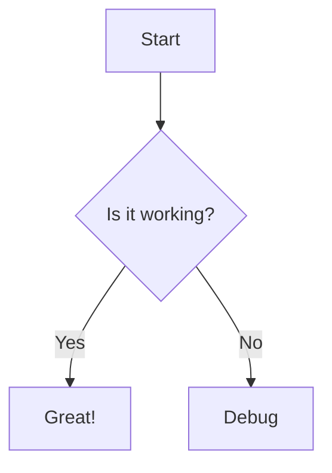

# Feature 4: Real-Time AI Tutoring

## Overview

The Real-Time AI Tutoring system provides multimodal, context-aware tutoring with streaming responses, RAG grounding, and support for text, voice, image, and diagram inputs/outputs. It adapts to student profiles and maintains conversation history.

## Architecture

```
Student Input → Content Moderation → RAG Retrieval → Prompt Building → LLM Generation →
Faithfulness Check → Response Streaming → TTS (optional) → Student
```

## Components

### 1. Tutor Engine

**File:** `backend/core/tutor_engine.py`

Core tutoring logic with:
- **RAG grounding**: Retrieves top-3 chunks via embedding search (fallback to keyword search)
- **Profile adaptation**: Adjusts tone/depth based on cognitive style (visual/verbal/mixed instructions)
- **Faithfulness checking**: Verifies claims against sources with warning prepending
- **Response type detection**: Determines if answer needs code, diagram, walkthrough, or voice
- **Mastery celebration**: Detects milestone achievements (50%, 80%) and celebrates
- **Weak point focus**: Extra scaffolding when current topic is a weak point
- **Learning path context**: Shows completed/current/upcoming topics
- **Mermaid diagram generation**: Auto-generates diagrams for visual/mixed learners

### 2. Conversation Management

**File:** `backend/api/routers/tutor_sessions.py`

Session-based chat with:
- **Session persistence**: Messages stored in database
- **Intelligent auto-titling**: LLM-generated titles from first exchange
- **Streaming support**: SSE for real-time responses
- **Stop generation**: Cancel in-flight requests

### 3. Streaming Responses

**Endpoint:** `POST /api/tutor/ask/stream`

SSE event types:
```
event: sources → {rag_chunks: [...]}
event: start → {timestamp}
event: delta → {token_chunk}
event: complete → {full_response}
event: error → {error_message}
```

### 4. Multimodal Support

#### Text Input/Output
- Standard chat interface
- Markdown rendering
- Code syntax highlighting
- Table formatting

#### Voice Input (ASR)
**File:** `backend/core/asr_client.py`, `backend/api/routers/asr.py`

iFlytek IAT (Instant Audio Transcription):
- **WebSocket streaming**: Real-time transcription
- **Frame encoding**: PCM 16kHz/16-bit
- **Auth signing**: HMAC-SHA256 API signature
- **Partial results**: Interim transcripts

**Frontend Hook:** `frontend/web/src/hooks/useVoiceStream.ts`

```typescript
const voice = useVoiceStream({
  language: "en_us",
  onPartial: (text) => setInputValue(text),
  onFinal: (text) => sendMessage(text),
});
```

#### Voice Output (TTS)
**File:** `backend/core/tts_client.py`

Edge-TTS + iFlytek fallback:
- **Content caching**: SHA256-based cache keys
- **Voice selection**: Multiple voices per language
- **Rate/volume control**: Adjustable speech parameters

#### Image Input
**File:** `backend/core/vision_llm_client.py`

Vision analysis using Kimi multimodal model:
- **Model**: Kimi 2.6 (multimodal)
- **Image compression**: Auto-compress to 500KB limit, max 1024px dimension
- **Compression strategy**: JPEG quality reduction (85→20), then resize (0.75→0.25 scale)
- **Supported formats**: PNG, JPEG, GIF, WebP
- **Max upload size**: 5MB (compressed before API call)

**Endpoints:**
- `POST /api/tutor/analyze-image`: General image analysis
- `POST /api/tutor/extract-equation`: LaTeX extraction

**Frontend Component:** `frontend/web/src/components/tutor/ImageUpload.tsx`

#### Diagram Output
**File:** `frontend/web/src/components/MermaidRenderer.tsx`

Mermaid diagram rendering:
- **Flowcharts**: TD/LR directions
- **Sequence diagrams**: Actor interactions
- **Class diagrams**: OOP structures
- **Gantt charts**: Timelines
- **Pie charts**: Data distribution

LLM generates mermaid syntax in code blocks:
```markdown

```

## RAG Grounding

**File:** `backend/rag/vector_store.py`

### Retrieval Process

1. **Query embedding**: Convert question to vector
2. **Similarity search**: Find top-k matching chunks
3. **Re-ranking**: Boost by source relevance
4. **Context injection**: Add chunks to LLM prompt

### System Prompt Structure

The tutor engine builds a comprehensive system prompt:

```python
system_prompt = f"""You are NoboGyan, a warm, enthusiastic learning companion...

Student Profile:
- Name: {student_name}
- Current topic: {current_topic or 'General'}
- Mastery level: {topic_mastery:.0%}
- Learning style: {cognitive_style}
- Weak points: {', '.join(weak_points) if weak_points else 'None identified'}
{weak_point_note}      # Extra scaffolding if topic is weak point
{mastery_celebration}  # 🎉 if just crossed 50% or 80%
{path_context}         # Learning journey progress

Your Personality & Approach:
🌟 Warm & Encouraging: Celebrate effort, not just correctness
🤝 Empathetic & Patient: Normalize struggle
🎯 Confidence Building: Use "yet" framing
📚 Learning-Focused: Connect to bigger picture

{style_instructions}   # Visual/Verbal/Mixed specific instructions

DIAGRAM GENERATION:
- Generate MERMAID diagrams in ```mermaid blocks
- Supported: flowcharts, sequence, class, ER, state diagrams
- Keep simple (5-10 nodes)
"""
```

## Faithfulness Verification

**File:** `backend/core/faithfulness_checker.py`

Every response is checked against sources:

```python
result = await faithfulness_checker.check_faithfulness(
    generated_text=answer,
    source_chunks=rag_chunks,
    context=current_topic
)
```

**Output:**
- `score`: 0.0-1.0 overall faithfulness
- `verified`: Boolean pass/fail
- `total_claims`: Number of claims made
- `supported_claims`: Claims with evidence
- `contradicted_claims`: Claims contradicting sources
- `warning_message`: User-facing warning if needed

## Content Moderation

**File:** `backend/core/content_moderator.py`

Harmful content filtering on all inputs:

```python
mod = content_moderator.moderate(user_input)
if mod.verdict == "block":
    return {"answer": mod.refusal_message, "blocked": True}
```

## Streaming Implementation

**Frontend Hook:** `frontend/web/src/hooks/useTutorSessions.ts`

```typescript
const sendMessage = async (content: string) => {
  const abortController = new AbortController();
  abortControllerRef.current = abortController;

  for await (const event of sendTutorMessageStream(
    sessionId,
    content,
    currentTopic,
    abortController.signal
  )) {
    if (event.event === "delta") {
      streamingTextRef.current += event.data;
      scheduleFlush();
    }
  }
};

const stopStream = () => {
  abortControllerRef.current?.abort();
};
```

## Intelligent Auto-Titling

**File:** `backend/api/routers/tutor_sessions.py`

Generates descriptive titles from first exchange:

```python
async def _generate_title(first_user_msg: str, first_assistant_msg: str) -> str:
    prompt = """Generate a short, descriptive chat title (max 5 words)...
    Student: {first_user_msg}
    Tutor: {first_assistant_msg}
    Title:"""
    # LLM generates title, falls back to truncation on failure
```

## Rolling Context with Summarization

**File:** `backend/core/conversation_manager.py`

The system maintains conversation context using a two-tier approach to prevent token overflow while preserving pedagogical context.

### Two-Tier Context Architecture

```
┌─────────────────────────────────────────────────────────────┐
│  CONTEXT WINDOW                                              │
│  ┌──────────────────────────────────────────┐               │
│  │  SUMMARY (compressed)                    │               │
│  │  "Discussed Docker containers,           │               │
│  │   Kubernetes pods, networking basics"    │               │
│  └──────────────────────────────────────────┘               │
│                                                             │
│  ┌──────────────────────────────────────────┐               │
│  │  RECENT TURNS (verbatim, last 6)         │               │
│  │  - Q: "How do services work?"            │               │
│  │  - A: "Services abstract pod access..."   │               │
│  │  - Q: "What's the difference?"            │               │
│  │  - A: "ClusterIP vs NodePort..."         │               │
│  └──────────────────────────────────────────┘               │
└─────────────────────────────────────────────────────────────┘
```

### How It Works

1. **Recent Messages (Full Fidelity)**
   - Last 6 complete turns (12 messages) kept verbatim
   - Provides immediate context for the LLM
   - Stored in memory and database

2. **Summarized History (Compressed)**
   - Older turns compressed via LLM when threshold exceeded
   - Key elements preserved: topics, understanding level, misconceptions, goals
   - Maximum 1500 characters

3. **Trigger Condition**
   - Summarization occurs when `len(messages) // 2 > 6` turns
   - Compresses 2 oldest turns at a time
   - Amortizes LLM calls across conversation

### Implementation

```python
class ConversationManager:
    def add_message(self, role, content):
        self.recent.append(Turn(role, content))
        self._maybe_summarize()  # Trigger if over threshold

    def _maybe_summarize(self):
        if len(self.recent) // 2 > 6:
            # Move 2 oldest turns to summary
            turns_to_compress = self.recent[:4]
            self.recent = self.recent[4:]
            self.summary = self._summarize_chunk(turns_to_compress)

    def get_context(self):
        # Returns: [summary system msg] + [recent turns]
        return [
            {"role": "system", "content": f"Earlier: {self.summary}"},
            *self.recent
        ]
```

### Persistence

- **Summary** stored in `ChatSession.context_summary` (Text)
- **Recent messages** stored in `ChatMessage` table
- On session load: restore summary + last 12 messages

### Fallback on Failure

If LLM summarization fails:
- Appends placeholder: `"[Student discussed more topics.]"`
- Logs error for monitoring
- Conversation continues without loss

---

## Implementation Details

### Key Files

| File | Purpose |
|------|---------|
| `backend/core/tutor_engine.py` | `TutorEngine` class with RAG, streaming, profile adaptation, mastery detection |
| `backend/core/vision_llm_client.py` | `VisionLLMClient` using Kimi 2.6 for image analysis with compression |
| `backend/core/tts_client.py` | Edge-TTS + iFlytek TTS with caching |
| `backend/core/asr_client.py` | `IFlytekASRClient` with WebSocket streaming, frame protocol |
| `backend/core/conversation_manager.py` | `ConversationManager` with rolling context and LLM summarization |
| `backend/api/routers/tutor.py` | `/ask`, `/ask/stream`, `/speak`, `/analyze-image`, `/extract-equation` |
| `backend/api/routers/tutor_sessions.py` | Session CRUD, message history, streaming messages, auto-titling |
| `backend/api/routers/asr.py` | `/transcribe`, `/stream` (WebSocket), `/status` |
| `backend/rag/vector_store.py` | Vector store with embedding + keyword search fallback |

### API Endpoints

| Endpoint | Method | Description |
|----------|--------|-------------|
| `/api/tutor/ask` | POST | Non-streaming Q&A with RAG + faithfulness |
| `/api/tutor/ask/stream` | POST | Streaming Q&A (SSE) with disconnect detection |
| `/api/tutor/speak` | POST | Text-to-speech (returns MP3) |
| `/api/tutor/analyze-image` | POST | Image analysis (multipart form, max 5MB) |
| `/api/tutor/extract-equation` | POST | LaTeX extraction from equation images |
| `/api/tutor/sessions` | POST | Create new tutor session |
| `/api/tutor/sessions` | GET | List student's sessions (newest first) |
| `/api/tutor/sessions/{id}` | GET | Get session details with message count |
| `/api/tutor/sessions/{id}` | PATCH | Update session title/status |
| `/api/tutor/sessions/{id}` | DELETE | Archive session (soft delete) |
| `/api/tutor/sessions/{id}/messages` | GET | Load message history (paginated) |
| `/api/tutor/sessions/{id}/messages` | POST | Send message (blocking) |
| `/api/tutor/sessions/{id}/messages/stream` | POST | Send message (SSE streaming) |
| `/api/asr/transcribe` | POST | Speech-to-text (WAV/MP3 upload) |
| `/api/asr/stream` | WS | Real-time ASR WebSocket |
| `/api/asr/status` | GET | Check ASR configuration status |

### Frontend Components

| Component | File |
|-----------|------|
| Chat Interface | `frontend/web/src/app/(dashboard)/notebook/page.tsx` |
| Session Sidebar | `frontend/web/src/components/tutor/TutorSessionSidebar.tsx` |
| Image Upload | `frontend/web/src/components/tutor/ImageUpload.tsx` |
| Mermaid Renderer | `frontend/web/src/components/MermaidRenderer.tsx` |
| Faithfulness Badge | `frontend/web/src/components/FaithfulnessBadge.tsx` |
| Voice Stream Hook | `frontend/web/src/hooks/useVoiceStream.ts` |
| Tutor Sessions Hook | `frontend/web/src/hooks/useTutorSessions.ts` |

## Testing

### Test Files

| File | Tests | Coverage |
|------|-------|----------|
| `test_conversation_manager.py` | 27 tests | Turn dataclass, initialization, add_message, summarization, get_context, persistence |
| `test_asr_client.py` | 22 tests | Message parsing, frame building, WebSocket protocol, mock mode |
| `test_asr_router.py` | 12 tests | /status, /transcribe, /stream endpoints, error handling |
| `test_faithfulness_checker.py` | 15 tests | Claim extraction, verification, scoring |
| `test_content_moderator.py` | 18 tests | Harmful content detection, refusal messages |

**Total: 94+ tests for Feature 4**

### Key Test Cases

```python
# Conversation manager tests
test_summarization_triggered_at_threshold
test_no_summarization_below_threshold
test_context_with_summary
test_summarize_chunk_fallback_on_exception
test_from_db_factory

# ASR client tests
test_parse_ok_partial_segment
test_parse_final_segment_marks_end_of_stream
test_parse_error_code_returns_end_true

# ASR router tests
test_status_reports_configured
test_transcribe_success
test_transcribe_rejects_invalid_format
```

## Completion Status

**Status: 100% Complete**

| Requirement | Status | Notes |
|-------------|--------|-------|
| Text input/output | ✅ Complete | Markdown, code highlighting |
| Streaming responses | ✅ Complete | SSE with disconnect detection |
| RAG grounding | ✅ Complete | Embedding + keyword fallback |
| Faithfulness checking | ✅ Complete | Warning prepending on low scores |
| Voice input (ASR) | ✅ Complete | iFlytek IAT WebSocket |
| Voice output (TTS) | ✅ Complete | Edge-TTS + iFlytek |
| Image input | ✅ Complete | Kimi 2.6 multimodal with compression |
| Diagram output | ✅ Complete | Mermaid generation for visual learners |
| Session management | ✅ Complete | Full CRUD + soft delete |
| Auto-titling | ✅ Complete | LLM-generated, max 5 words |
| Stop generation | ✅ Complete | AbortController support |
| Content moderation | ✅ Complete | Input filtering on all endpoints |
| Rolling context | ✅ Complete | 6-turn window + LLM summarization |
| Profile adaptation | ✅ Complete | Visual/verbal/mixed instructions |
| Mastery celebration | ✅ Complete | 50%/80% milestone detection |

## Performance

- **Response latency**: 2-5 seconds for first token (depends on RAG retrieval)
- **Streaming throughput**: ~10-20 tokens/second
- **ASR latency**: ~200ms for partial results (40ms frame size)
- **TTS generation**: ~1 second for 100 words (cached)
- **Image analysis**: ~3-5 seconds (includes compression time)
- **Summarization**: ~1-2 seconds per chunk (amortized)

## Response Type Detection

The tutor engine automatically detects the best response type:

```python
def _detect_response_type(self, question: str, profile: Dict) -> str:
    if profile.get("hands_free"):
        return "voice"
    
    # Problem-solving keywords → walkthrough
    problem_keywords = ["how do i", "how to", "step by step", "solve", "debug", "implement"]
    if any(kw in question_lower for kw in problem_keywords):
        return "walkthrough"
    
    # Conceptual + visual learner → diagram
    conceptual_keywords = ["what is", "explain", "difference between", "compare", "why"]
    if any(kw in question_lower for kw in conceptual_keywords) and "visual" in cognitive_style:
        return "diagram"
    
    return "text"
```

## Database Schema

**ChatSession Model**:
```python
class ChatSession(Base):
    session_id = Column(String(50), primary_key=True)
    student_id = Column(String(50), ForeignKey("student_profiles.student_id"))
    session_type = Column(String(20))  # "tutor" | "profiling"
    status = Column(String(20))  # "active" | "archived"
    title = Column(String(100))  # LLM-generated or default
    current_node_id = Column(String(50))  # Current topic context
    context_summary = Column(Text)  # Rolling summary
    created_at = Column(DateTime(timezone=True))
    updated_at = Column(DateTime(timezone=True))
```

**ChatMessage Model**:
```python
class ChatMessage(Base):
    message_id = Column(String(50), primary_key=True)
    session_id = Column(String(50), ForeignKey("chat_sessions.session_id"))
    role = Column(String(20))  # "user" | "assistant"
    content = Column(Text)
    content_type = Column(String(20))  # "text" | "code" | "image"
    created_at = Column(DateTime(timezone=True))
```

## Future Enhancements

1. **Voice activity detection**: Auto-start recording
2. **Real-time collaboration**: Multi-student sessions
3. **Proactive tutoring**: Trigger based on struggle detection
4. **Equation rendering**: MathJax/KaTeX for LaTeX display
5. **Code execution**: Sandboxed code runner for practice
