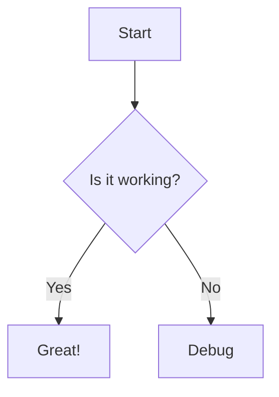

# Feature 4: Real-Time AI Tutoring

## Overview

The Real-Time AI Tutoring system provides multimodal, context-aware tutoring with streaming responses, RAG grounding, and support for text, voice, image, and diagram inputs/outputs. It adapts to student profiles and maintains conversation history.

## Architecture

```
Student Input → Content Moderation → RAG Retrieval → Prompt Building → LLM Generation →
Faithfulness Check → Response Streaming → TTS (optional) → Student
```

## Components

### 1. Tutor Engine

**File:** `backend/core/tutor_engine.py`

Core tutoring logic with:
- **RAG grounding**: Retrieves relevant chunks from vector store
- **Profile adaptation**: Adjusts tone/depth based on cognitive style
- **Faithfulness checking**: Verifies claims against sources
- **Response type detection**: Determines if answer needs code, diagram, etc.

### 2. Conversation Management

**File:** `backend/api/routers/tutor_sessions.py`

Session-based chat with:
- **Session persistence**: Messages stored in database
- **Intelligent auto-titling**: LLM-generated titles from first exchange
- **Streaming support**: SSE for real-time responses
- **Stop generation**: Cancel in-flight requests

### 3. Streaming Responses

**Endpoint:** `POST /api/tutor/ask/stream`

SSE event types:
```
event: sources → {rag_chunks: [...]}
event: start → {timestamp}
event: delta → {token_chunk}
event: complete → {full_response}
event: error → {error_message}
```

### 4. Multimodal Support

#### Text Input/Output
- Standard chat interface
- Markdown rendering
- Code syntax highlighting
- Table formatting

#### Voice Input (ASR)
**File:** `backend/core/asr_client.py`, `backend/api/routers/asr.py`

iFlytek IAT (Instant Audio Transcription):
- **WebSocket streaming**: Real-time transcription
- **Frame encoding**: PCM 16kHz/16-bit
- **Auth signing**: HMAC-SHA256 API signature
- **Partial results**: Interim transcripts

**Frontend Hook:** `frontend/web/src/hooks/useVoiceStream.ts`

```typescript
const voice = useVoiceStream({
  language: "en_us",
  onPartial: (text) => setInputValue(text),
  onFinal: (text) => sendMessage(text),
});
```

#### Voice Output (TTS)
**File:** `backend/core/tts_client.py`

Edge-TTS + iFlytek fallback:
- **Content caching**: SHA256-based cache keys
- **Voice selection**: Multiple voices per language
- **Rate/volume control**: Adjustable speech parameters

#### Image Input
**File:** `backend/core/vision_llm_client.py`

Vision-capable model routing:
- **GPT-4o**: Primary vision model
- **GPT-4o-mini**: Fallback
- **Claude 3**: Alternative
- **Gemini Pro Vision**: Alternative

**Endpoints:**
- `POST /api/tutor/analyze-image`: General image analysis
- `POST /api/tutor/extract-equation`: LaTeX extraction

**Frontend Component:** `frontend/web/src/components/tutor/ImageUpload.tsx`

#### Diagram Output
**File:** `frontend/web/src/components/MermaidRenderer.tsx`

Mermaid diagram rendering:
- **Flowcharts**: TD/LR directions
- **Sequence diagrams**: Actor interactions
- **Class diagrams**: OOP structures
- **Gantt charts**: Timelines
- **Pie charts**: Data distribution

LLM generates mermaid syntax in code blocks:
```markdown

```

## RAG Grounding

**File:** `backend/rag/vector_store.py`

### Retrieval Process

1. **Query embedding**: Convert question to vector
2. **Similarity search**: Find top-k matching chunks
3. **Re-ranking**: Boost by source relevance
4. **Context injection**: Add chunks to LLM prompt

### Prompt Template

```python
system_prompt = """You are A3, a helpful learning assistant. Answer the student's 
question using the provided context. If the context doesn't contain the answer, 
say so honestly.

Context:
{rag_chunks}

Student Profile:
- Cognitive Style: {cognitive_style}
- Learning Pace: {learning_pace}
- Weak Points: {weak_points}
"""
```

## Faithfulness Verification

**File:** `backend/core/faithfulness_checker.py`

Every response is checked against sources:

```python
result = await faithfulness_checker.check_faithfulness(
    generated_text=answer,
    source_chunks=rag_chunks,
    context=current_topic
)
```

**Output:**
- `score`: 0.0-1.0 overall faithfulness
- `verified`: Boolean pass/fail
- `total_claims`: Number of claims made
- `supported_claims`: Claims with evidence
- `contradicted_claims`: Claims contradicting sources
- `warning_message`: User-facing warning if needed

## Content Moderation

**File:** `backend/core/content_moderator.py`

Harmful content filtering on all inputs:

```python
mod = content_moderator.moderate(user_input)
if mod.verdict == "block":
    return {"answer": mod.refusal_message, "blocked": True}
```

## Streaming Implementation

**Frontend Hook:** `frontend/web/src/hooks/useTutorSessions.ts`

```typescript
const sendMessage = async (content: string) => {
  const abortController = new AbortController();
  abortControllerRef.current = abortController;

  for await (const event of sendTutorMessageStream(
    sessionId,
    content,
    currentTopic,
    abortController.signal
  )) {
    if (event.event === "delta") {
      streamingTextRef.current += event.data;
      scheduleFlush();
    }
  }
};

const stopStream = () => {
  abortControllerRef.current?.abort();
};
```

## Intelligent Auto-Titling

**File:** `backend/api/routers/tutor_sessions.py`

Generates descriptive titles from first exchange:

```python
async def _generate_title(first_user_msg: str, first_assistant_msg: str) -> str:
    prompt = """Generate a short, descriptive chat title (max 5 words)...
    Student: {first_user_msg}
    Tutor: {first_assistant_msg}
    Title:"""
    # LLM generates title, falls back to truncation on failure
```

## Implementation Details

### Key Files

| File | Purpose |
|------|---------|
| `backend/core/tutor_engine.py` | Core tutoring logic |
| `backend/core/vision_llm_client.py` | Image analysis |
| `backend/core/tts_client.py` | Text-to-speech |
| `backend/core/asr_client.py` | Speech recognition |
| `backend/api/routers/tutor.py` | Tutor endpoints |
| `backend/api/routers/tutor_sessions.py` | Session management |
| `backend/api/routers/asr.py` | ASR endpoints |
| `backend/rag/vector_store.py` | RAG retrieval |

### API Endpoints

| Endpoint | Method | Description |
|----------|--------|-------------|
| `/api/tutor/ask` | POST | Non-streaming Q&A |
| `/api/tutor/ask/stream` | POST | Streaming Q&A (SSE) |
| `/api/tutor/speak` | POST | Text-to-speech |
| `/api/tutor/analyze-image` | POST | Image analysis |
| `/api/tutor/extract-equation` | POST | LaTeX extraction |
| `/api/tutor/sessions` | GET/POST | Session CRUD |
| `/api/tutor/sessions/{id}/messages` | GET/POST | Message CRUD |
| `/api/tutor/sessions/{id}/messages/stream` | POST | Streaming messages |
| `/api/asr/transcribe` | POST | Speech-to-text |
| `/api/asr/stream` | WS | Real-time ASR |

### Frontend Components

| Component | File |
|-----------|------|
| Chat Interface | `frontend/web/src/app/(dashboard)/notebook/page.tsx` |
| Session Sidebar | `frontend/web/src/components/tutor/TutorSessionSidebar.tsx` |
| Image Upload | `frontend/web/src/components/tutor/ImageUpload.tsx` |
| Mermaid Renderer | `frontend/web/src/components/MermaidRenderer.tsx` |
| Faithfulness Badge | `frontend/web/src/components/FaithfulnessBadge.tsx` |
| Voice Stream Hook | `frontend/web/src/hooks/useVoiceStream.ts` |
| Tutor Sessions Hook | `frontend/web/src/hooks/useTutorSessions.ts` |

## Testing

- **33 tests** in `backend/tests/test_asr_client.py`
- **10 tests** in `backend/tests/test_asr_router.py`

## Completion Status

**Status: ~85% Complete**

| Requirement | Status |
|-------------|--------|
| Text input/output | ✅ Complete |
| Streaming responses | ✅ Complete |
| RAG grounding | ✅ Complete |
| Faithfulness checking | ✅ Complete |
| Voice input (ASR) | ✅ Complete |
| Voice output (TTS) | ✅ Complete |
| Image input | ✅ Complete |
| Diagram output | ✅ Complete |
| Session management | ✅ Complete |
| Auto-titling | ✅ Complete |
| Stop generation | ✅ Complete |
| Content moderation | ✅ Complete |
| Rolling context with summarization | ❌ Not implemented |

## Performance

- **Response latency**: 2-5 seconds for first token
- **Streaming throughput**: ~10-20 tokens/second
- **ASR latency**: ~200ms for partial results
- **TTS generation**: ~1 second for 100 words
- **Image analysis**: ~3-5 seconds

## Future Enhancements

1. **LLM-powered summarization**: Compress old conversation history
2. **Voice activity detection**: Auto-start recording
3. **Real-time collaboration**: Multi-student sessions
4. **Proactive tutoring**: Trigger based on struggle detection
